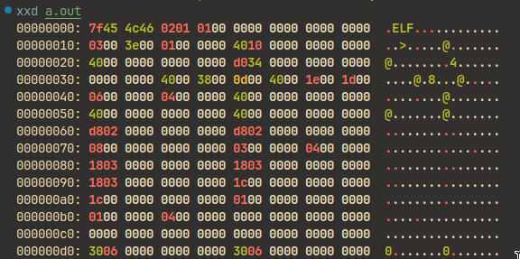
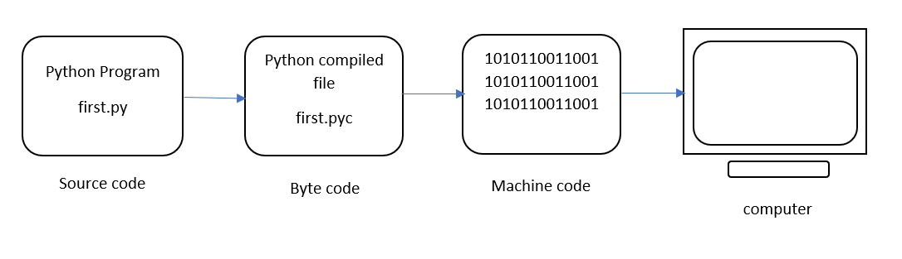
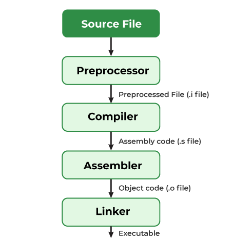

## What are we going to talk about?

Today we are mainly going to talk about what happens behind the scenes in C. We will discuss the following topics:

What...

- happens to your code when you compile it?
- is the role of the preprocessor?
- is the role of the compiler?
- is the role of the assembler?
- is the role of the linker?

## Why do we need to know this?

- Write more efficient code
- Debug your code more effectively.
- It is fun!
- Because you are a Computer Engineering student!

## Why do we need to compile our code?

- Computers do not understand C code.
- Computers understand machine code.
- We need to convert our C code to machine code.
- This is the job of the compiler.

## What the programmer sees

```c
#include <stdio.h>

int main() {
    printf("Hello, World!\n");
    return 0;
}
```

## What the computer sees



## The role of a compiler

This is where the need for a compiler comes in. The compiler is a program that translates the code you write into machine code that the computer can understand.

## Interpreted vs. Compiled

You might ask:

**Wait, but my Python code runs without compiling it!**

This is where interpreted languages come in. Interpreted languages are languages that are not compiled. Instead, they are interpreted by another program called an interpreter.

## Interpreted languages

Most common interpreted languages:

- Python
- Ruby
- JavaScript
- PHP
- ...

## A bit of information about interpreters

Languages like python first convert your code to an intermediate form called bytecode. This bytecode is then interpreted by the interpreter. At runtime, the interpreter reads the bytecode and executes the instructions.



## A bit of C compiler history

- The first C compiler was written by Dennis Ritchie in 1972.
- Read more about it [here](https://www.bell-labs.com/usr/dmr/www/chist.html).
- C has matured a lot since then.

## GNU Compiler Collection (GCC)

Later on, the GNU project developed the GNU Compiler Collection (GCC). GCC is a free and open-source compiler that supports many programming languages, including C.

Richard Stallman, the founder of the Free Software Foundation, started the GNU project in 1983.

{width=20%}

## Richard Stallman

{width=50%}

## Small advice

- I highly recommend you to study the history of the GNU project and the Free Software Foundation.
- It is a very interesting story.
- Even Richard Stallman is a unique person with unique ideas.

## Other C compilers

- Besides GCC, there are other C compilers available.
- Some of them are:
  - Clang
  - Intel C Compiler
  - Microsoft Visual C++
  - ...

## The C compilation process

The C compilation process consists of several steps:

{width=50%}

## Preprocessing

The first step in the compilation process is preprocessing. The preprocessor is a program that processes the source code before it is compiled.

The preprocessor performs the following tasks:

- Remove comments
- Include header files
- Expands macros
- ...

## Seeing the preprocessed code

You can see the preprocessed code by using the `-E` flag with the compiler.

```bash
gcc -E hello.c
```

## Using compilerexplorer.com

You can also use [Compiler Explorer](https://godbolt.org/) to see the preprocessed code.

This is a very useful tool for overall seeing what is happening behind the scenes.

It is also useful for comparing different compilers.

## Compiling the code

In this stage, the preprocessed code is compiled into assembly code. The compiler is responsible for this task. The compiler performs the following tasks:

- Syntax analysis
- Semantic analysis
- Optimization
- Code generation
- ...

## Seeing the assembly code

You can see the assembly code by using the `-S` flag with the compiler.

```bash
gcc -S hello.c
```

## The asm code is platform-dependent

- The assembly code generated by the compiler is platform-dependent. This means that the assembly code generated for one platform may not work on another platform. This is
because different platforms have different instruction sets.

- The current platform that we are running is `x86_64`.

- Other platforms may include `ARM`, `MIPS`, `PowerPC`, `SPARC`, ...

## Assembling the code

In this stage, the assembly code is converted into machine code. The assembler is responsible for this task.

## Assembling the code (cont.)

In order to assemble our assembly code, we can use the following command:

```bash
gcc -c hello.s
```

This will generate an object file called `hello.o`.
This object file contains the machine code for our program.

## What is an object file?

An object file is a file that contains machine code for a program. It is generated by the assembler. The object file is not executable. It needs to be linked with other object files to create an executable file.

Characteristics of an object file:

- Not directly executable
- Contains binary code alongside symbols (e.g., function names)
- typically has a `.o` or `.obj` extension

## Linking the code

In this stage, the object file is linked with other object files to create an executable file. The linker is responsible for this task.

## What is linking exactly?

Linking is the process of combining multiple object files into a single executable file. The linker performs the following tasks:

- Resolves external references
- Combines object files
- Resolve urresolved symbols

## Why is linking necessary?

- When you write a program, you may use functions from other files.
- These functions are defined in other object files.
- The linker is responsible for combining these object files into a single executable file.
- This is why linking is necessary.

## Types of linking

There are two types of linking:

- Static linking: The linker combines all object files into a single executable file.
- Dynamic linking: The linker creates a small executable file that loads the required libraries at runtime.

## Linking example

In order to link our object file, we can use the following command:

```bash
gcc hello.o -o hello
```

This will generate an executable file called `hello`.

## Linking an external library

In order to link an external library, we can use the following command:

```bash
gcc hello.o -o hello -lm
```

`-lm` is the flag for linking the math library.

## Why did stdio.h not need to be linked?

The `stdio.h` header file is not linked because it is part of the standard C library. The standard C library is automatically linked by the compiler.

## Overall process

The overall process of compiling a C program can be summarized as follows:

1. *Preprocessing*: The preprocessor processes the source code.
   `gcc -E hello.c`
2. *Compiling*: The compiler compiles the preprocessed code into assembly code.
   `gcc -S hello.c`
3. *Assembling*: The assembler assembles the assembly code into machine code.
   `gcc -c hello.s`
4. *Linking*: The linker links the object file with other object files to create an executable file.
